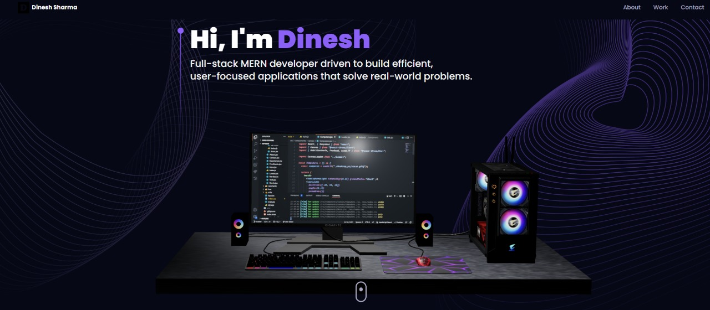

# 🚀 Dinesh Sharma – 3D Developer Portfolio

> A visually engaging, interactive 3D developer portfolio built with **React**, **Three.js**, **React Three Fiber**, and **Framer Motion** — designed to make a strong first impression and showcase your work with immersive visuals.

---

## 📸 Preview

<p align="center">
  
</p>

---

## 📖 About the Project

This project is not just a portfolio — it’s a **fully immersive 3D web experience** designed to reflect creativity, technical skills, and attention to detail. Built using cutting-edge frontend tools, it offers a modern and engaging way to present your projects, skills, and personal story.

Whether you're applying for jobs, seeking freelance work, or simply showing off your craft, this portfolio gives you a unique edge.

---

## 🔋 Features

### ✨ 3D Hero Section
- Animated 3D desktop model using `Three.js` and `React Three Fiber`
- Fully customizable and interactive

### 📚 About & Experience
- Smooth scroll animations powered by `Framer Motion`
- Clean layout with timeline-style work history

### 🧠 Skills in 3D
- Tech stack visualized with animated 3D geometries
- Scroll-triggered transitions

### 💼 Projects & Testimonials
- Eye-catching project cards with hover and fade effects
- Testimonials section for social proof

### 🌍 Contact with Earth Model
- Realistic rotating 3D Earth model in the contact section
- Functional contact form powered by `EmailJS`

### 🌌 Starry Background
- Dynamic background with procedurally generated stars using `Three.js`

### 📱 Responsive Design
- Fully responsive across all screen sizes
- Smooth UX on desktop, tablet, and mobile

---

## 🧱 Tech Stack

| Category         | Tech Used                         |
|------------------|-----------------------------------|
| **Framework**    | React.js                          |
| **3D Engine**     | Three.js, React Three Fiber, Drei |
| **Styling**      | Tailwind CSS                      |
| **Animation**    | Framer Motion                     |
| **Email**        | EmailJS                           |
| **Bundler**      | Vite                              |

---

### 📦 Clone the Repository

```bash
git clone https://github.com/your-username/dinesh-portfolio.git
cd dinesh-portfolio

```
# 📥 Install Dependencies

npm install
```
```
# 🔐 Configure Environment Variables
Create a .env file in the root directory:

REACT_APP_EMAILJS_USERID=your_emailjs_user_id
REACT_APP_EMAILJS_TEMPLATEID=your_emailjs_template_id
REACT_APP_EMAILJS_RECEIVERID=your_emailjs_receiver_id
```

```
# 🚀 Run the Development Server

npm run dev
Visit http://localhost:5173 to see your portfolio in action.


```


```
## 📁 Project Structure

```
dinesh-portfolio/
├── public/
├── src/
│   ├── assets/          # Images, textures, models
│   ├── components/      # Navbar, Hero, About, Skills, etc.
│   ├── canvas/          # 3D objects and rendering logic
│   ├── constants/       # Static content (skills, links, etc.)
│   ├── styles/          # Tailwind and global styles
│   ├── utils/           # Animation configs, helpers
│   ├── App.jsx
│   └── main.jsx
├── .env
├── tailwind.config.cjs
└── vite.config.js
```

# 📄 License
This project is open-source and available under the MIT License.

```


```
# 🙌 Author
Made with 💻 by Dinesh Sharma

🧑‍💻 GitHub: @ds1910

🌐 Portfolio: dineshsharma.dev

📧 Email: your.email@example.com

💼 LinkedIn: linkedin.com/in/ds1910

If you liked this project, don't forget to ⭐️ the repo and share it!

